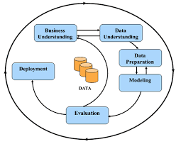

# Solution Implementation
### Prototype Description
A python script that takes in an input image and returns the identified skin defect as well as the model's confidence level for the said prediction.

## Model Development
The **CRISP-DM** model was used for the development of skInsight. CRISP-DM (Cross-Industry Standard Process for Data Mining) is a widely adopted framework for data mining projects, including those in computer vision. It provides a structured, iterative approach to guide teams through the entire data mining process, from business understanding to deployment.

## Technologies Used
1. **Google Colab** for model training
2. **Azure ML Studio (Notebooks)** for development of inference script
3. **VSCode** for coding
4. **Github** for version control
5. **Github Projects** for project management
6. **Python** for model training and inferencing.
   Python modules used:
    - Tensorflow
    - Keras
    - Pandas
    - Numpy
    - Scikit-learn
    - PIL
    - os
    - matplotlib

## Deployment Stack
1. **Azure ML Studio**
    - Notebooks for inference scripting
    - Compute for compute creation and management
    - Models for model registering
     

## Challenges faced
1. **Small Git LFS bandwidth**: This hampered the deployment to Azure App Services, and Streamlit.
2. **Deployment to Azure App Services** (Error 503 bug): Visual Studio Enterprise Subscription did not allow for the creation for GPU computes. Thus, the web application kept crashing due to insifficient resources.
